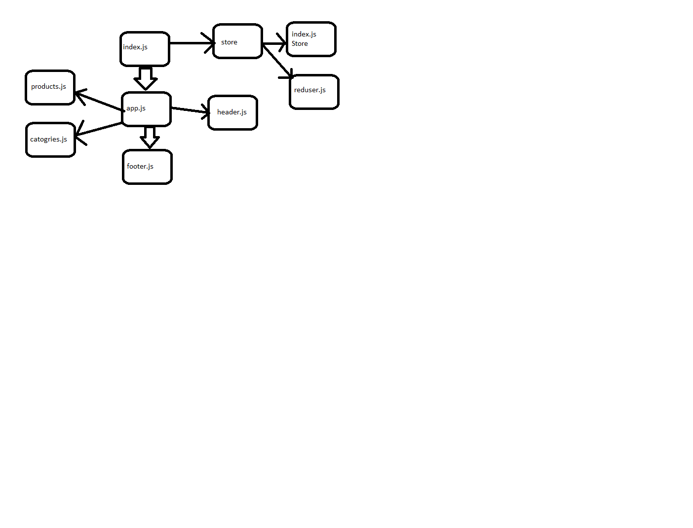

# LAB - Class 36

## Project: storefront

### Author: Yazan Aljamal

### Links and Resources

- [submission PR](https://github.com/yaljamal-401-advanced-javascript/storefront/pull/1)
- [netlify](https://lab38-redux.netlify.app/)

### Setup

`$npx i`

#### How to initialize/run your application

- `$ npm start`

#### UML

